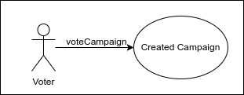
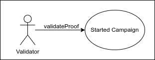
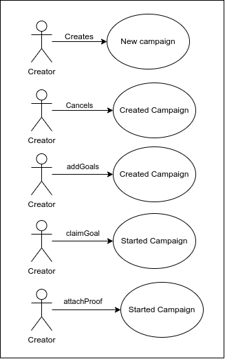
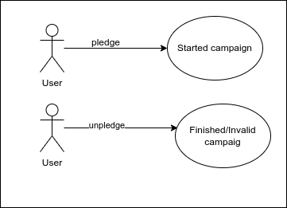
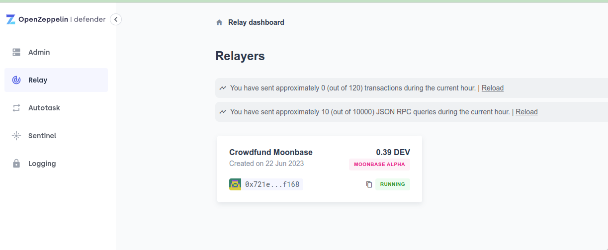
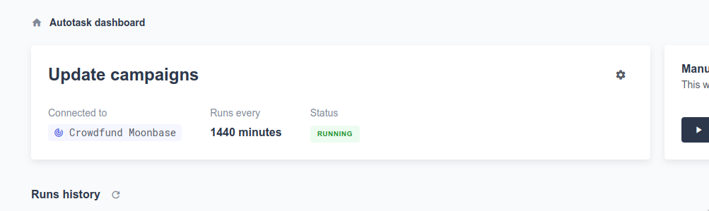
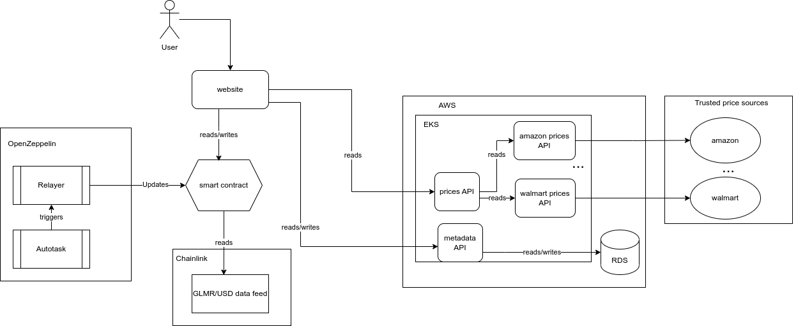

# Solid Fund smart contracts

[](https://github.com/SolidFund/Solid-Fund-smart-contracts/actions/workflows/contract.yaml)

This project implements a crowdfunding platform that allows users to create fundraising campaigns and to participate as donors in them. The smart contract leverages the Moonbeam technology, the project uses Chainlink Price Feed contract for price conversions and OpenZeppelin Defender to automate the off-chain execution.

## Our Story 

The project was inspired by the inequity and difficulties faced by marginalized communities in accessing financing and resources for their social projects. The lack of opportunities limited their ability to generate positive impact and improve their living conditions. This reality sparked the desire to build a crowdfunding platform that could eliminate barriers and connect social entrepreneurs with committed donors globally. The inspiration came from the belief in the power of collective support and solidarity to create significant change in the most vulnerable communities. The project was developed with the purpose of providing equal opportunities and promoting collaboration to drive socially positive and sustainable projects.

Our project is a crowdfunding platform that connects social entrepreneurs with committed donors. We facilitate fundraising for social projects, allowing people to present their ideas and obtain the necessary financial support to make them a reality. Our platform provides a transparent, secure, and efficient form of financing, and aims to promote active community participation in decision-making. By bringing project creators and donors together, we drive the generation of innovative and sustainable solutions for social challenges, thereby improving the quality of life in communities and generating a positive impact on society.

The project was built by defining the project's vision, mission, and values, establishing the objectives and goals we wanted to achieve. Then, we conducted thorough research on crowdfunding and the challenges it faced, identifying opportunities for improvement.

Based on this research, we designed the crowdfunding platform, focusing on the Moonbeam blockchain to ensure transparency and security in transactions. We carry out the technical implementation of the platform, ensuring that it met the required standards of quality and functionality.

## About SolidFund

Our project is based on the implementation of a crowdfunding platform that addresses the main issues associated with traditional crowdfunding. We believe in the importance of providing access to funding for social projects and fostering community participation in decision-making.

In our approach, we strive to overcome geographical barriers that limit project reach by allowing initiatives to reach a global audience. We want to provide social projects with the opportunity to obtain funds internationally and maximize their fundraising potential.

Transparency is a fundamental value for us. Through the use of Moonbeam technology, we aim to provide a high level of transparency and traceability in the fundraising process. We want donors to easily verify how funds are being utilized and if campaign objectives are being met.

Furthermore, we believe in active community participation. We want to give donors a voice and a vote in decisions related to funded projects. We aim to foster community connection and involvement to build a platform that reflects the needs and desires of its users.

Protection against scams and fraudulent projects is a priority for us. We will implement robust security and verification measures to ensure the authenticity of projects presented on our platform. We want to give donors the confidence that their contributions will be used appropriately and for the intended purposes.

In summary, we are committed to overcoming the challenges associated with traditional crowdfunding and providing a more accessible, transparent, and participatory platform. We are excited to drive efficient fundraising and support social projects that seek to generate a positive impact on society.


## Problem description 

Main problems of traditional crowdfunding:

1. Geographical barriers: Traditional crowdfunding often limits itself to a specific region or country, making it difficult for projects to reach a global audience and limiting their fundraising potential.

2. Lack of transparency: Traditional funding processes may lack transparency regarding how raised funds are utilized. Donors may have difficulties in tracking and verifying the use of funds by project creators.

3. Limited community participation: In many cases, donors in traditional crowdfunding have no voice or vote in decisions related to funded projects. Community participation is limited, which can result in a lack of connection and involvement.

4. Insufficient protection against scams: Risks of scams and fraudulent projects exist in traditional crowdfunding. Donors can become victims of scammers who present false or deceptive projects and disappear once they have collected the funds.

## Solution or how the project helps to solve the problem 

SolidFund would address the following points:

1. Access to funding: It would provide social projects with an opportunity to obtain funds to carry out their initiatives. Many social projects lack the necessary financial resources, and this platform would offer them a way to access the necessary support.

2. Transparency: By utilizing Moonbeam technology, the platform could provide a level of transparency and traceability in the fundraising process. Participants would be able to easily verify how funds are being utilized and if campaign goals are being achieved.

3. Goal validation: The platform would allow campaign goals to be validated by participants and validators. This would ensure that funded projects have clear objectives and that funds are effectively used to achieve those goals.

4. Community participation: By enabling users to vote for campaigns they believe should be funded, the platform would encourage community participation in decision-making and project selection. This creates a sense of community and empowerment among participants.

5. Fund security: The platform could guarantee the security of funds raised. Participants can have confidence that their contributions are protected and will be used appropriately.

In summary, the crowdfunding platform would address issues related to access to funding, transparency, goal validation, community participation, and fund security in the realm of social projects.

## Project Description

The Solid Fund smart contract enables users to create fundraising campaigns for social projects with specified goals and durations. Participants can pledge funds to these campaigns, either in Glimmer (GLMR) or a specified ERC20 stable token (while the smart contracts are deployed on Moonbase Alpha "DEV" is the token used). The progress of each campaign is tracked, and when a campaign meets its goals, the creator can claim the funds and provide proof of achieving the campaign's objective. Validators can review the proof and validate or invalidate the goal accordingly.

## Features

### Campaign Creation

Users can create fundraising campaigns by specifying the number of goals, start and end dates.

### Campaign Cancellation

The creator of a campaign can cancel it if it hasn't started yet.

### Goal Creation

Once a campaign is created, the creator can add multiple goals with corresponding funding targets.

### Pledging

Users can pledge funds to ongoing campaigns by contributing Glimmer (GLMR) or a specified ERC20 stable token (while the smart contracts are deployed on Moonbase Alpha "DEV" is the token used).

### Unpledging

Users can retract their pledge if the campaign is in an invalid or finished state.

### Campaign Status Updates

The contract automatically updates the status of campaigns based on the start and end dates, goal validations, and funding achievements by using ChainLink Automation.

### Goal Claiming

Campaign creators can claim funds when they meet the goals by providing proof of achievement.

### Proof Attachment

Campaign creators can attach proof of goal achievement for validation by validators.

### Proof Validation

Validators can review the attached proof and validate or invalidate the goal accordingly.

### Voting

Users with the voter role can vote for campaigns they believe should be funded.

## Roles/Actors

The smart contract includes the following actors/roles:

### Owner

The contract deployer who has the ability to pause and unpause the contract and grant/revoke voter and validator roles. This role can execute every method.

### Voter

Users with this role can vote for campaigns they believe should be funded.



### Validator

Users with this role can review and validate or invalidate the attached proof for campaign goals.



### Campaign Creator

The user who creates a campaign. They have additional permissions related to campaign management.



### Users

The user who donates to a campaign.



### Automation

We're using OpenZeppelin Defender (Relayer and Autotask) to automate the execution of the method "updateCampaigns".




## Smart Contract Dependencies

The Solid Fund smart contract relies on the following external contracts and libraries:

### OpenZeppelin Contracts

#### Ownable

Provides basic access control and ownership functionality.

#### Pausable

Allows pausing and unpausing the contract.

#### AccessControl

Enables managing role-based access control.

#### Chainlink Contracts

AggregatorV3Interface: Provides the interface for accessing price feed data.

#### ERC20

An interface for interacting with ERC20 tokens.

## Design

### Architecture

The user interacts with the contract by using a front-end. Optionally, they can use the verified contract directly. The campaign's goals are obtained from an aggregator that is a service that gets some products from validated markets. We're using OpenZeppelin Defender with an autotask executed by a relayer (the autotask code is [here](automation/index.js))



### Technology

- Solidity: Smart Contract
- Hardhat: Deploy and verification of the contracts
- ChainLink: data feed
- OpenZeppelin: contracts and Defender (Autotask and Relayer)
- React: front-end
- Third-web: web framework
- NodeJs: mock APIs
- Python: aggregator API
- GitHub Actions: CI pipeline
- Docker and Docker Compose: local development

## Smart Contract

### Description

The Solid Fund smart contract allows users to create crowdfunding campaigns, pledge Glimmer (GLMR) or ERC-20 tokens to campaigns, vote for campaigns, add campaign goals, and claim goals based on the campaign's success. The contract includes role-based access control and pause functionality to ensure secure and controlled operations. All the metadata related to the campaign is saved in a different service called "metadata API".

Finally, the solution uses ChainLink data price feeds to convert the Glimmer (GLMR) or the specified ERC20 stable token (while the smart contracts are deployed on Moonbase Alpha "DEV" is the token used) price to USD when the creator wants to claim a goal and also OpenZeppelin Defender to execute the contract off-chain and update the campaign status.

### Methods

#### Campaigns

- `create(uint256 _goals, uint256 _startAt, uint256 _endAt)`: Creates a new crowdfunding campaign with the specified goals, start time, and end time.
- `cancel(uint256 _id)`: Cancels a campaign that has been created but not yet started.
- `addGoals(uint256 _id, NewGoal[] calldata _goals)`: Adds campaign goals to a created campaign.
- `getCampaigns()`: Retrieves an array of all campaigns.
- `getGoals(uint256 _id)`: Retrieves an array of goals for a specific campaign.
- `claimGoal(uint256 _id, uint256 _goalId)`: Allows the campaign owner to claim a specific goal if the required funds or tokens have been raised.
- `attachProof(uint256 _id, uint256 _goal_id, string calldata _goal_proof)`: Allows the campaign owner to attach proof of achieving a goal.

#### Donations

- `pledge(uint256 _id, uint256 _amount)`: Allows users to pledge Glimmer (GLMR) or tokens to a started campaign.
- `unpledge(uint256 _id)`: Allows users to unpledge their Glimmer (GLMR) or tokens from a campaign that is either finished or invalid.

#### Validations

- `validateProof(uint256 _id, uint256 _goal_id, GoalStatus _status)`: Allows a validator to validate or invalidate the proof attached to a goal.

#### Votes

- `voteCampaign(uint256 _id)`: Allows voters to vote for a campaign.

#### Pause Functionality

- `pause()`: Pauses stakings and withdrawals in the contract.
- `unpause()`: Unpauses stakings and withdrawals in the contract.

#### Permissions Methods

- `grantVoterRole(address _address)`: Grants the voter role to the specified address.
- `revokeVoterRole(address _address)`: Revokes the voter role from the specified address.
- `grantValidatorRole(address _address)`: Grants the validator role to the specified address.
- `revokeValidatorRole(address _address)`: Revokes the validator role from the specified address.

### Roles

- `VOTER_ROLE`: Role assigned to addresses that are allowed to vote for campaigns.
- `VALIDATOR_ROLE`: Role assigned to addresses that are allowed to validate proofs.

### Dependencies

The Solid Fund smart contract has the following dependencies:

- Chainlink Contracts: Provides the AggregatorV3Interface for price feed data.
- OpenZeppelin Contracts: Provides base contracts for Ownable, Pausable, and AccessControl functionalities.

## Production

The solution isn't placed in Moonbeam mainnet yet.

## Testnet

Currenly we're using Moonbase Alpha testnet:

- MockERC20 deployed to 0xF2e43E5e222E5f0B4584315637C569f66938835F
- Solid Fund deployed to 0xb390F2d000d6d5b6fAd0717Fad290B64DE8e613c

### Verification

**Solid Fund**
`npx hardhat verify --network moonbase --contract contracts/Crowdfund.sol:CrowdFund 0xb390F2d000d6d5b6fAd0717Fad290B64DE8e613c 0xF2e43E5e222E5f0B4584315637C569f66938835F 6048000 1 0x537879A0beA294c1ce04161Ae827919e92C23e92`

**MockERC20**
`npx hardhat verify --network moonbase --contract contracts/MockERC20.sol:MockERC20 0xF2e43E5e222E5f0B4584315637C569f66938835F`

## Local usage

### Requirements

- Docker
- Docker compose

### Start the components

To run the project locally you should use Docker compose. Once installed, build and run the containers using the command:

```
docker-compose up
```

or

```
docker-compose up --build
```

if you want to rebuild the projects.

To watch the containers use the command

```
docker ps
```

### Components

#### Aggregator

This service collects the items and prices for verified markets. It should be available at `localhost:5000/products`. You can also get a specific product price using `localhost:5000/products/id`

#### Smart Contract

It will run in the local blockchain in the container called `blockchain`. It should be available at `0.0.0.0:8545` (the chain id is 31337). Check the contract address in the output of the `bootstrap` container:

`bootstrap   | Crowdfund deployed to 0xe7f1725E7734CE288F8367e1Bb143E90bb3F0512 `

#### Metadata

This service will save the metadata for the campaign (name, description, etc). To create a new entry send a POST to `localhost:4000/campaigns`, a GET to `localhost:4000/campaigns` to get all the campaigns or `localhost:4000/campaigns/<id>` to get just one campaign. The body in the post can be any body because it's a mock API.

## Contributing

Thank you for considering contributing to the Solid Fund project! Contributions are highly encouraged and welcome. Here are a few ways you can contribute:

- Report issues: Help identify and report any bugs or issues you encounter while using the platform by opening an issue in the repository.

- Suggest improvements: If you have ideas for improving the project, feel free to open an issue and share your suggestions.

- Submit pull requests: If you'd like to contribute code changes or enhancements to the project, you can submit a pull request. Make sure to follow the project's guidelines and coding conventions.

Before contributing, please review the [contribution guidelines](CONTRIBUTING.md) for this project.

## License

This project is licensed under the [MIT License](LICENSE.md).
